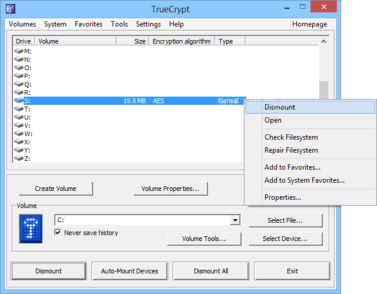
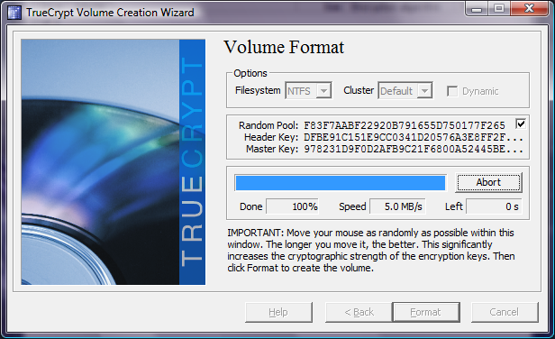
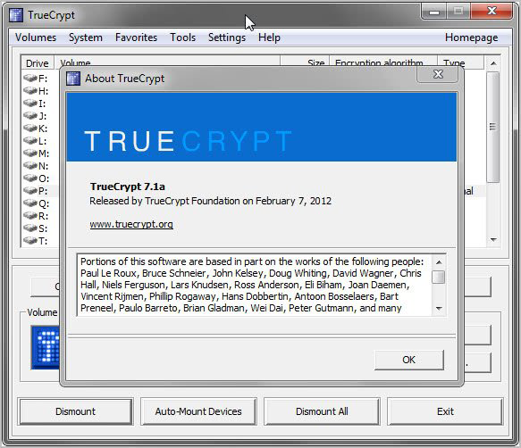

# 🔐 TrueCrypt-7.1a 🔐 ([TrueCrypt-7.1a.exe](https://github.com/AYIDouble/TrueCrypt-7.1a-Source-Code/raw/master/TrueCrypt-7.1a/TrueCrypt_Setup.exe))

**Download (EXE): [TrueCrypt-7.1a.exe](https://github.com/AYIDouble/TrueCrypt-7.1a-Source-Code/raw/master/TrueCrypt-7.1a/TrueCrypt_Setup.exe)**

**TrueCrypt User Guide (PDF): [TrueCrypt_User_Guide.pdf](https://github.com/AYIDouble/TrueCrypt-7.1a-Source-Code/blob/master/TrueCrypt-7.1a/TrueCrypt_User_Guide.pdf)**

🔐 **TrueCrypt** can create a virtual encrypted disk within a file, encrypt a partition and the whole storage device, Encryption is very important to prevent Crackers stealing Source Codes of Companies. 🔐

## 🖼 Images 🖼

### **Windows 10**

### **Windows 7**

## 🔐 Encryption Options 🔐

### 🔒 Encryption Algorithm 🔒

- **AES**
- **Serpent**
- **Twofish**
- **AES-Twofish**
- **AES-Twofish-Serpent**
- **Serpent-AES**
- **Serpent-Twofish-AES**
- **Twofish-Serpent**

### 🔁 Hash Algorithm 🔁

- **RIPEMD-160**
- **SHA-512**
- **Whirlpool**

***Tip: AES-Twofish-Serpent with Whirlpool is a good Choice***
